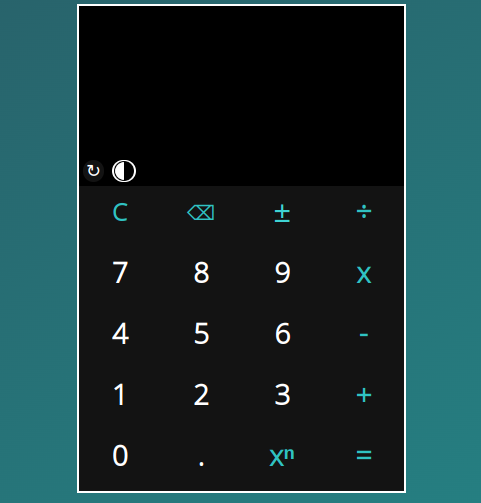

# Calculator

## Result

[LIVE DEMO](https://silva-mo.github.io/Calculator/)

## About
This is my fifth TOP project, it requires a good understanding of HTML/CSS/JS basics in general.

This time I wanted to make this project special and different from the other projects, and I really think that I did a good job in terms of making it different.

Alhamdulillah

## What was needed to complete it:
- Problem-Solving skills
- Patience 
- Good CSS Flexbox and Grid manipulation skills
- Dealing with JS Event Listeners, Conditionals, string and array methods,Functions and more...

## Challenges that I've overcame: 
- Making the calculator smart and responsive by using a lot of conditionals to prevent errors 
- Organizing the calculator screen div to avoid overflow issues